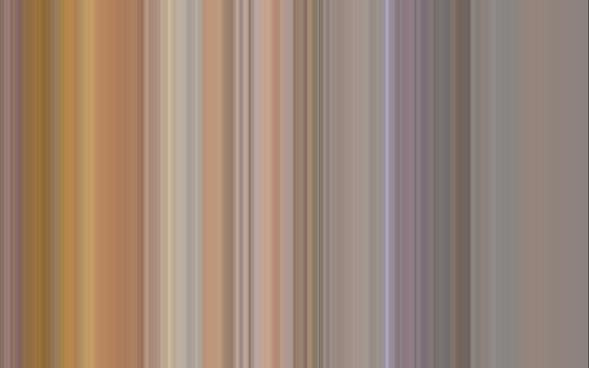

# slit_scan-app

It's a Streamlit app which you can reach by this link:
https://share.streamlit.io/csrdsg/slit_scan-app/main/main.py

## Normal mode:
Get the same slit from every frame. Keeps the original resolution by deafult. 

## Average mode:
Finds the avarage color by slit. 

## Dominant mode:
Finds the dominant color by slit.

